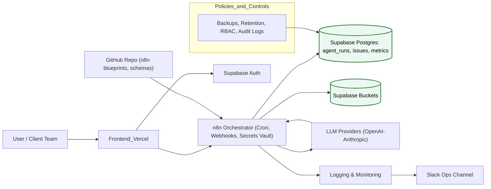

# live_evals-agent

A tiny demo that:
- Streams multi‑agent events over SSE from a Node/Express backend
- Visualizes them in a Vite + React + Tailwind frontend (Timeline + KPIs)
- Triggers a Make scenario at end‑of‑session that computes KPIs, runs an LLM‑judge, writes a Notion report, and (optionally) pings Slack

This project is respectful of SOC 2 Trust Principles
[Security & Trust](./SECURITY.md)

## 🧩 SOC 2-Ready Data Flow

